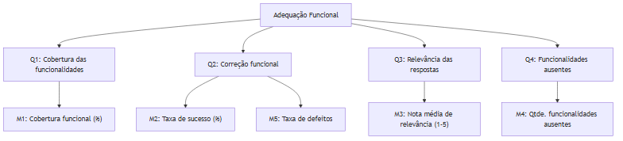

# Adequação Funcional — Modelo GQM

## Objetivo GQM
- Analisar o sistema Mural UnB
- Com o propósito de verificar a completude e correção das funcionalidades essenciais
- Com respeito a Adequação Funcional (completude, correção, adequação)
- Sob o ponto de vista de Estudantes da UnB
- No contexto de uso cotidiano (busca, recomendações, publicação e navegação do feed)

## Questões
1. Em que medida as funcionalidades essenciais (busca, recomendação, publicação, feed) cobrem os requisitos declarados e as necessidades dos estudantes?
2. Qual é o nível de correção funcional observável nas operações essenciais (ex.: resultados corretos em buscas; publicação sem falhas)?
3. As funcionalidades retornam informações relevantes e utilizáveis para os estudantes (adequação do conteúdo apresentado)?
4. Existem funcionalidades ausentes, redundantes ou comportamentos que impedem o uso efetivo?

## Hipóteses
1. As funcionalidades essenciais estão implementadas e mapeadas para os requisitos definidos na Fase 1 (>= 90% de cobertura dos requisitos funcionais prioritários).
2. A maioria dos cenários de uso essenciais executa corretamente sem comportamento incorreto perceptível (taxa de sucesso operacional >= 95% em testes funcionais).
3. Os resultados de busca e recomendações apresentam relevância percebida suficiente pelos usuários (nota média ≥ aceitabilidade definida, ex.: 4/5).
4. Existem poucas funcionalidades ausentes ou redundantes que afetem a utilidade global.

## Métricas
- M1 — Cobertura de requisitos funcionais prioritários: (n_impl_prioritarias / n_prioritarias) * 100.
- M2 — Taxa de sucesso de cenários de uso: % cenários essenciais sem falha (testes automatizados/manuais).
- M3 — Nota média de relevância atribuída por usuários às respostas/recomendações (escala Likert 1–5).
- M4 — Número de funcionalidades faltantes/redundantes identificadas (contagem).
- M5 — Taxa de defeitos funcionais por funcionalidade: defeitos_reportados / execuções_de_teste.

## Tabela resumida

| Questão | Métrica(s) principal(is) | Rubrica (exemplo) |
|---|---|---|
| Cobertura das funcionalidades | M1: % Cobertura funcional | 5: >=95% — 1: <65% |
| Correção funcional | M2: % cenários sem falha; M5: defeitos/execução | 5: >=98% — 1: <80% |
| Relevância das respostas | M3: Nota média (1–5) | 5: 4.5–5.0 — 1: <3.0 |
| Funcionalidades ausentes | M4: Qtde. identificada | contagem simples |

_Tabela — Resumo das questões, métricas e rubricas para Adequação Funcional._

## Diagrama

_Figura — Diagrama GQM para Adequação Funcional._
