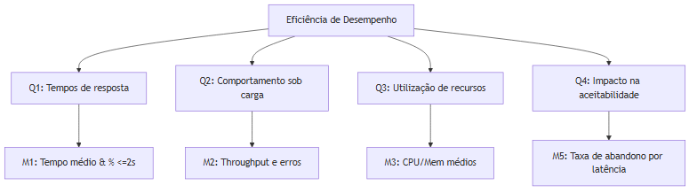

# Eficiência de Desempenho — Modelo GQM

## Objetivo GQM
- Analisar o sistema Mural UnB
- Com o propósito de avaliar tempos de resposta e uso de recursos sob cargas típicas e de pico
- Com respeito a Eficiência de Desempenho (comportamento temporal, utilização de recursos, capacidade)
- Sob o ponto de vista de Estudantes da UnB
- No contexto de operação web com acesso simultâneo via navegador e chamadas ao backend

## Questões
1. Quais são os tempos de resposta percebidos para as operações críticas (carregamento do feed, pesquisas, requisições de recomendação) sob carga normal?
2. Como se comporta o sistema em condições de carga aumentada (escalabilidade e degradação)?
3. Qual a utilização média de recursos (CPU, memória, I/O) por operação/pedido?
4. A latência percebida impacta a aceitabilidade do usuário (abandonos, tempo na página)?

## Hipóteses (padronizadas)
1. Pelo menos 95% das requisições das operações críticas são respondidas em menos de 5 segundos em condições normais de uso.
2. Sob aumento de carga até X usuários simultâneos (X a definir na fase experimental), pelo menos 90% das requisições continuam a receber resposta adequada, sem falhas catastróficas.
3. A utilização média de recursos por pedido permanece dentro dos limites operacionais definidos pelo ambiente de hospedagem (CPU, memória e I/O).
4. Aumento significativo na latência está associado a um aumento mensurável na taxa de abandono das sessões de usuário.

## Métricas (simplificadas)
- M1 — Tempo médio de resposta por operação (ms): `avg(response_time)`; e percentual de requisições com resposta <= 2s.
- M2 — Throughput (requests/s) para operações críticas.
- M3 — Utilização de recursos por unidade de tempo (CPU %, memória MB) durante testes: média e pico.
- M4 — Taxa de erro sob carga: `errors / total_requests`.
- M5 — Taxa de abandono relacionada à latência: `% sessões que encerraram antes de completar a interação por tempo de resposta alta` (analytics).

## Tabela resumida

| Questão | Métrica(s) principal(is) | Rubrica (exemplo) |
|---|---|---|
| Tempos de resposta | M1: tempo médio & % <=2s | 5: avg <1.5s & >=95% requests<=2s — 1: avg>5s |
| Comportamento sob carga | M2: throughput & erros | medir degradação por intervalo de carga |
| Utilização de recursos | M3: CPU/mem médios e picos | limites operacionais definidos |
| Impacto na aceitabilidade | M5: taxa de abandono por latência | 5: <2% — 1: >20% |

_Tabela — Resumo das questões, métricas e rubricas para Eficiência de Desempenho._

## Diagrama

_Figura — Diagrama GQM para Eficiência de Desempenho._
