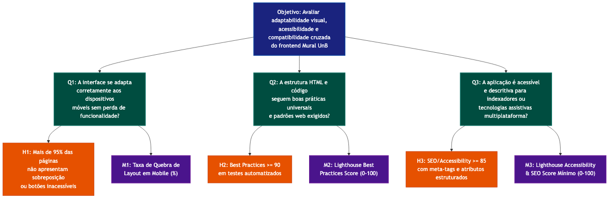

# Portabilidade

A Portabilidade avalia a capacidade do sistema em operar efetivamente em diferentes ambientes tecnológicos, abrangendo a responsividade do frontend e a aderência a boas práticas (Best Practices e SEO).

## 1. Nível Conceitual: Objetivo de Medição

Conforme a priorização na Fase 1, a Portabilidade é essencial devido à grande diversidade de dispositivos utilizados pelos estudantes para acessar oportunidades.

- **Analisar:** O frontend do sistema Mural UnB.
- **Para o propósito de:** Avaliar a adaptabilidade visual, acessibilidade e compatibilidade cruzada.
- **Com respeito à:** Portabilidade (Adaptabilidade e Compatibilidade Web).
- **Do ponto de vista de:** Usuários Finais (Estudantes da UnB).
- **No contexto de:** Acesso via diferentes navegadores web (Chrome, Firefox, Safari) e tamanhos de tela (Mobile e Desktop).

## 2. Nível Operacional: Questões e Hipóteses

- **Q1:** A interface da aplicação se adapta corretamente aos dispositivos móveis sem perda de funcionalidade (Layout Responsivo)?
  - **H1:** Mais de 95% das páginas essenciais (Home e Feed) não apresentam sobreposição de elementos ou botões inacessíveis quando testados em resoluções de tela móvel no DevTools.
- **Q2:** A estrutura HTML e o código seguem as boas práticas universais e padrões web exigidos pelos navegadores modernos?
  - **H2:** A pontuação agregada de _Best Practices_ do sistema é igual ou superior a 90 em testes automatizados, evitando problemas de compatibilidade silenciosos.
- **Q3:** A aplicação é adequadamente acessível e descritiva para indexadores ou tecnologias assistivas multiplataforma?
  - **H3:** A pontuação de _SEO / Accessibility_ atinge pelo menos 85, assegurando que elementos gráficos possuem meta-tags e atributos estruturados.

## 3. Nível Quantitativo: Métricas

As métricas utilizam ferramentas e inspeções focadas puramente no frontend moderno (`site/`).

- **M1 — Taxa de Quebra de Layout em Mobile (%):** `(Telas com erro visual detectado / Total de Telas Analisadas) * 100`. (Responde Q1).
- **M2 — Lighthouse Best Practices Score (0-100):** Avaliação de confiança da arquitetura web baseada nos padrões do navegador Chrome (Responde Q2).
- **M3 — Lighthouse Accessibility & SEO Score Mínimo (0-100):** Menor nota obtida entre SEO e Acessibilidade (Responde Q3).

## 4. Níveis de Pontuação e Critérios de Julgamento

A ferramenta de validação será inspeção visual auxiliada pelo DevTools do navegador e execução do Google Lighthouse para garantir imparcialidade.

| Nível                | M1 - Taxa de Quebra de Layout                               | M2 - Best Practices Score | M3 - Accessibility/SEO Score | Critério de Julgamento Geral (Portabilidade)                                                                                        |
| :------------------- | :---------------------------------------------------------- | :------------------------ | :--------------------------- | :---------------------------------------------------------------------------------------------------------------------------------- |
| **5 (Excelente)**    | 0% (Nenhum layout quebra).                                  | >= 95                     | >= 95                        | A aplicação funciona nativamente como uma experiência fluida em qualquer dispositivo ou navegador testado.                          |
| **4 (Bom)**          | &lt;= 10% (Pequenos desalinhamentos que não impedem o uso). | >= 85 e &lt; 95           | >= 85 e &lt; 95              | Excelente portabilidade, com raras exceções gráficas pontuais em telas muito reduzidas.                                             |
| **3 (Satisfatório)** | > 10% e &lt;= 20%                                           | >= 70 e &lt; 85           | >= 70 e &lt; 85              | O site funciona em mobile, mas a experiência visual não é adequada e requer muito _scroll_ horizontal ou botões difíceis de clicar. |
| **2 (Insuficiente)** | > 20% e &lt;= 40% (Funcionalidades bloqueadas em mobile).   | >= 50 e &lt; 70           | >= 50 e &lt; 70              | Apresenta falhas de renderização em determinados navegadores ou o Mobile é praticamente inavegável.                                 |
| **1 (Crítico)**      | > 40%                                                       | &lt; 50                   | &lt; 50                      | Site desenvolvido estritamente para desktop de forma inflexível, violando normas W3C.                                               |

## 5. Representação da Hierarquia

